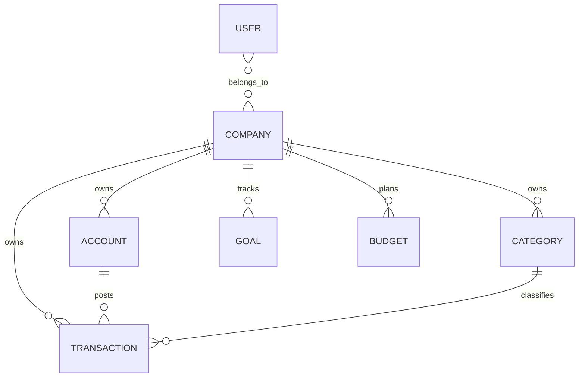

# Data Model

> SDD discovery: **persistence is owned by the Air Finance API** (MongoDB / Mongoose). This monorepo holds **client-side types** and shapes consumed from HTTP responses.

## Overview

| Layer | Technology | Owner repo |
| --- | --- | --- |
| Authoritative persistence | MongoDB, Mongoose schemas | `back-end-financeiro-nestjs` |
| Banking integration audit / tenant | PostgreSQL, TypeORM | `connexto-integration-bank` |
| Web client models | TypeScript interfaces + zod where used | `air-finance-app` (`apps/web`, `packages/shared`) |

Schema migrations for Mongo are applied as part of API releases (not in this frontend repo). There is **no** `DATABASE_URL` or ORM in `apps/web`.

## Conceptual domain model (product)

Entities below mirror how the product behaves; field-level schemas live in the API.

| Concept | Description | Typical keys / scope |
| --- | --- | --- |
| User | Authenticated identity; may belong to many companies | `id`, session via JWT / cookies |
| Company | Tenant for financial data | `companyId`; active company in UI store |
| Account | Bank account, wallet, or credit-card-as-account | `companyId`, `accountId`, balance config, optional `integration` |
| Transaction | Income/expense line; categories, installments, reconciliation | `companyId`, `accountId`, `categoryId`, amounts, dates |
| Category | User-defined classification | `companyId`, `categoryId` |
| Credit card | Card + bills (may overlap with `Account` type `credit_card` in API) | Scoped by company |
| Budget / Goals | Planning and targets | Derived from transactions + settings |
| Recurring | Template for generated transactions | Links to created transactions |

## Conceptual relationships

## Frontend representation

- **TanStack Query** caches server entities by query key (usually scoped by `companyId`).
- **Zustand** must not duplicate server financial state; use for UI, auth session handles, active company id, preferences.
- **Forms**: `react-hook-form` + **zod** for input validation before mutations.

## Indexes and constraints

Authoritative indexes and DB constraints are documented in the API repo (`docs/` and Mongoose `@Prop` indexes). When changing list UX or filters, confirm matching API query support.

## Migration policy (this repo)

- No database migrations here. **Type changes** follow API releases: update `packages/shared` and/or service DTO types, then `yarn typecheck`.

## PII handling (client)

- Do not log tokens, cookies, or full account numbers in application code.
- Follow [AUTH_SESSION_IMPLEMENTATION.md](./AUTH_SESSION_IMPLEMENTATION.md) and [SECURITY_FIX_REPORT.md](./SECURITY_FIX_REPORT.md) for session and company-scoping rules.
