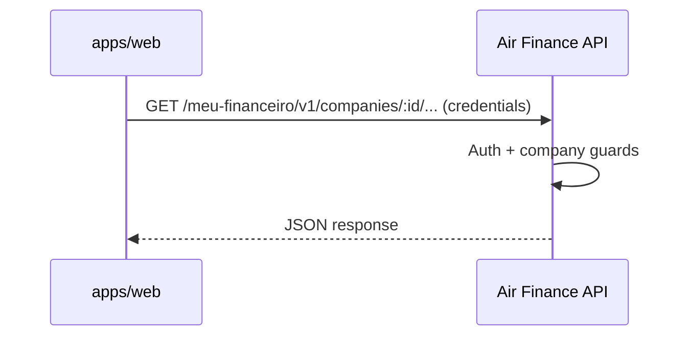

# Integrations

> From **`air-finance-app`**, outbound calls go primarily to the **Air Finance API**. Third-party systems (Stripe, banks, OpenAI, etc.) are integrated **by the backend** (and Connexto service), not directly from the browser—except where the product intentionally loads a third-party script or OAuth redirect.

## Inventory (frontend boundary)

| System | Direction | Protocol | Auth | Notes |
| --- | --- | --- | --- | --- |
| Air Finance API | Outbound | HTTPS REST | Cookie JWT / Bearer | Single integration surface for `apiClient` |
| Google OAuth | Redirect | HTTPS | OAuth2 | Handled via API callbacks; see auth docs |
| Vercel / hosting | Outbound | HTTPS | Deploy token (CI) | Build and env configuration only |

## Air Finance API (primary)

- **Purpose**: All product data and commands.
- **Client**: `apps/web/src/services/*` + `apiClient.ts`.
- **Env**: `VITE_API_URL` (and related Vite-prefixed vars documented in [VERCEL_DEPLOY.md](./VERCEL_DEPLOY.md)).
- **Failure mode**: UI shows error states; TanStack Query retries according to hook configuration.
- **Observability**: Browser devtools network tab; API-side Pino logs on server.

## Indirect integrations (via API)

These are **not** called from the SPA directly in normal flows; listed for architectural awareness.

| System | Role | Owner |
| --- | --- | --- |
| Stripe | Subscriptions, checkout | Nest API `subscription` module |
| Connexto Integration Bank | Banking, PIX, statements, Open Finance | Nest API `integrations/banking` → Connexto HTTP |
| OpenAI | Categorization / agents | Nest API modules |

## Sequence (typical read)

## Outage playbook

| If down | First action |
| --- | --- |
| API unavailable | Show maintenance/error UI; avoid destructive local state changes |
| Auth cookie invalid | Trigger refresh flow or redirect to login per `apiClient` interceptors |

## Change management

- New **external** integration from the browser requires security review (secrets, CORS, CSP) and likely an ADR.
- Prefer extending the **API** for new third parties so credentials never ship to the client.
