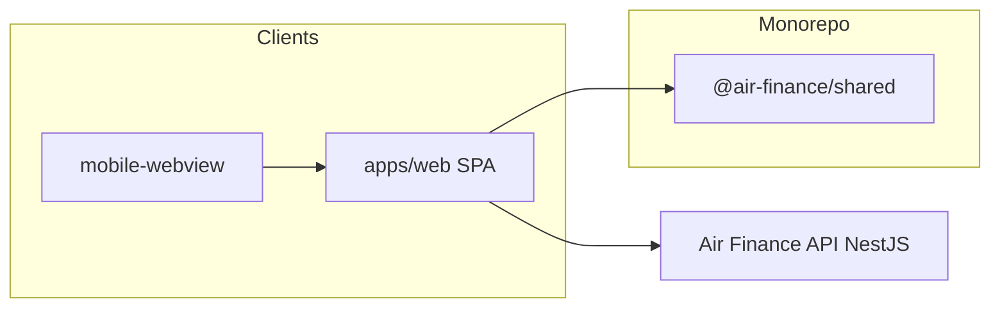
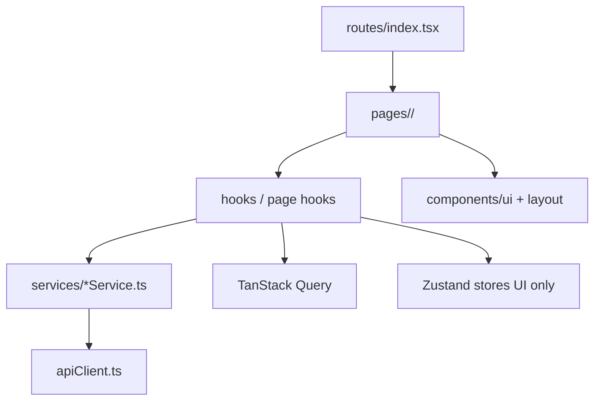

# Modules

> SDD discovery snapshot for this monorepo. Refresh when adding workspaces or changing boundaries.

## Module map

| Module | Path | Responsibility | Dependencies |
| --- | --- | --- | --- |
| Web app | `apps/web/src/` | Product SPA: routes, pages, hooks, services (`apiClient`), TanStack Query, Zustand (UI/auth/company UI state) | `@air-finance/shared`, backend REST API |
| Mobile WebView | `apps/mobile-webview/` | Expo shell loading the web app in WebView; tunnel dev | `@air-finance/web` (conceptual parity with deployed web) |
| Shared package | `packages/shared/` | Types, constants, utilities shared by web and mobile | None (pure TS) |
| Documentation | `docs/` | Architecture, domain, SDD discovery artifacts | N/A |
| SDD memory | `memory/` | Project constitution (non-code principles) | N/A |
| Specs | `specs/` | Feature specs and contracts (Spec-Driven) | N/A |

This repository does **not** contain the NestJS API or banking service; those live in sibling repos (`back-end-financeiro-nestjs`, `connexto-integration-bank`).

## Dependency graph (runtime)

## In-app layering (`apps/web`)

## Conventions (this monorepo)

- **Pages**: `apps/web/src/pages/<feature>/` with `index.tsx`, `components/`, `hooks/` as needed.
- **Global UI**: `apps/web/src/components/` (feature folders + `ui/` primitives).
- **HTTP**: all calls through `apiClient`; feature logic in `services/`.
- **Tests**: colocated `*.test.ts` / `*.test.tsx` with Vitest and Testing Library (see `.cursor/rules/sdd-protocol.mdc`).
- **Shared types**: prefer `packages/shared` for cross-app contracts; API response shapes may also live next to services when API-specific.

## Adding a new surface

1. Add route in `apps/web/src/routes/index.tsx` (lazy import).
2. Add page folder under `pages/<feature>/` using `ViewDefault` or `LayoutAuth` as appropriate.
3. Add service + hook; wire TanStack Query keys consistently.
4. Update [ARCHITECTURE.md](./ARCHITECTURE.md) or this file if the module boundary is new.
