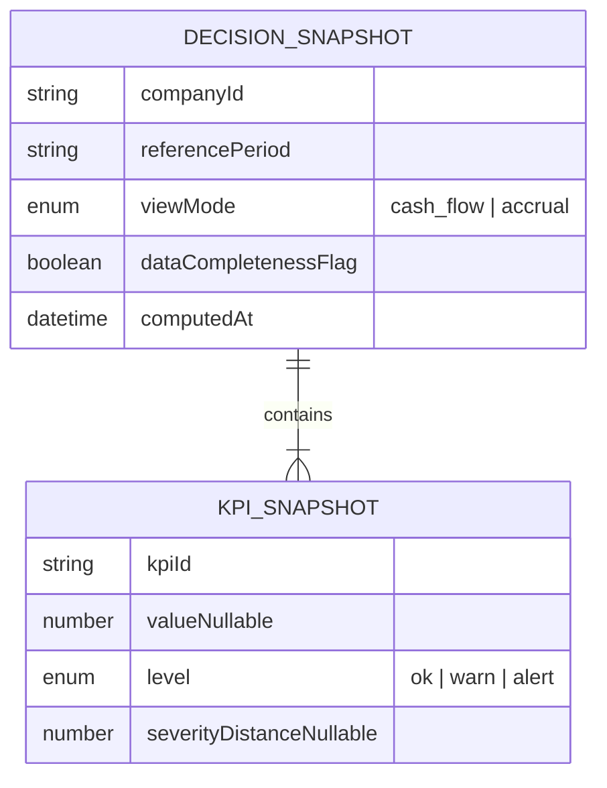

# Data model — Decision Engine

## 1. Persistence (v1)

**Nenhuma coleção Mongo obrigatória** para o motor na v1. A decisão é **derivada** de um snapshot em memória.

Opcional futuro:

| Entidade | Propósito |
| --- | --- |
| `DecisionAuditLog` | Armazenar `inputHash`, `output`, `ruleEngineVersion`, `companyId`, `createdAt` para suporte/LGPD |

## 2. Logical model (snapshot)

- **`severityDistance`:** distância à fronteira da zona (para FR-2); opcional no input — se ausente, resolver pode derivar de `value` + bandas fixas **somente se** bandas forem duplicadas no backend na v1; **recomendação:** composer envia `severityDistance` já calculado pelo mesmo módulo que calcula níveis, para single source of truth.

## 3. Completude de dados (FR-0) — critérios mínimos v1

**Definição:** snapshot **completo** quando todas as condições abaixo são verdadeiras.

| # | Regra | Se falhar |
| --- | --- | --- |
| C1 | `referencePeriod` presente (ISO `YYYY-MM`) | Incompleto |
| C2 | `viewMode` presente | Incompleto |
| C3 | `netIncomeMonth` informado e **> 0** (renda líquida do período — base para % e poupança) | Incompleto |
| C4 | KPI obrigatório `monthly_cash_flow`: `value` numérico válido **e** `level` definido | Incompleto |
| C5 | KPI obrigatório `savings_rate`: `level` definido (valor pode ser omitido só se política upstream marcar inválido → incompleto) | Incompleto |
| C6 | KPI obrigatório `income_committed_pct`: `level` definido | Incompleto |
| C7 | KPI obrigatório `credit_utilization_index`: `level` definido **e** se `level` ≠ `ok`, exige `value` numérico (uso %) para parametrizar impacto | Incompleto **apenas se** `value` ausente quando ≠ ok |
| C8 | KPI obrigatório `surplus_capacity`: `level` definido | Incompleto |
| C9 | KPI obrigatório `fixed_vs_variable_split`: `level` definido (interpretar como “share fixo alto” quando alert) | Incompleto |

**KPIs opcionais (ausência ≠ incompleto):**

| KPI | Comportamento |
| --- | --- |
| `checking_runway_days` | Se ausente, degrau 1 liquidez considera **apenas** `monthly_cash_flow`. |
| `debt_service_to_income` | Se ausente, pular degrau 2 (`debt_pressure`). |

**Reason em FR-0:** popular `reason` com `["data_quality"]` ou lista dos `kpiId` que falharam completude.

## 4. Matriz ação × contexto (v1 seed)

Parametrização: placeholders `{amount}`, `{pct}`, `{days}` substituídos quando número disponível; senão texto qualitativo permitido pela spec.

### `data_incomplete`

| # | title | description | impact | reason |
| --- | --- | --- | --- | --- |
| 1 | Complete seus dados financeiros | Cadastre renda líquida do mês, limite dos cartões e movimentações para gerarmos recomendações seguras. | Complete os campos em vermelho na visão mensal para ver impacto em R$. | Dinâmico: KPIs/`data_quality` conforme §3 (campo `ordering_rationale` + `actions[].reason`) |

### `healthy`

| # | title | description | impact | reason |
| --- | --- | --- | --- | --- |
| 1 | Automatize sua sobra | Configure uma transferência fixa para reserva no dia após o pagamento. | Mesmo **R$ 50/mês** já consolidam hábito sem apertar o orçamento. | `["savings_rate"]` |

### `liquidity_risk`

| # | title | description | impact | reason |
| --- | --- | --- | --- | --- |
| 1 | Pausar gastos não essenciais por 30 dias | Congele compras discricionárias até o fluxo voltar ao azul. | Reduz risco de cheque especial até **{amount}/mês** se você cortar o plano variável médio. | `monthly_cash_flow`, `checking_runway_days` |
| 2 | Redesenhar datas de vencimento | Alinhe boletos e cartão para depois das entradas de renda. | Ganho de liquidez equivalente a **{days} dias** de folga de caixa. | `monthly_cash_flow` |
| 3 | Usar apenas débito ou PIX até normalizar | Evite novas compras no crédito enquanto o caixa estiver negativo. | Impede aumento de **{pct}%** no uso do limite. | `credit_utilization_index`, `monthly_cash_flow` |

### `debt_pressure`

| # | title | description | impact | reason |
| --- | --- | --- | --- | --- |
| 1 | Negociar ou refinanciar o menor saldo de alto juro | Priorize cartão/rotativo antes de empréstimo barato. | Economia típica **{amount}/mês** em juros se taxa cair **{pct} p.p.** | `debt_service_to_income` |
| 2 | Congelar novos parcelamentos | Não adicione parcelas até serviço da dívida cair abaixo de 25% da renda. | Libera até **{pct}%** da renda para caixa. | `debt_service_to_income`, `income_committed_pct` |

### `credit_overuse`

| # | title | description | impact | reason |
| --- | --- | --- | --- | --- |
| 1 | Pagar acima do mínimo no cartão principal | Destine valor fixo semanal até uso cair abaixo de 40%. | Reduz uso de **{pct}%** para meta **40%** em ~2–3 ciclos. | `credit_utilization_index` |
| 2 | Parar compras no crédito até normalizar | Use débito até `credit_utilization_index` sair de alerta. | Alto impacto no caixa | `credit_utilization_index` |

### `high_commitment`

| # | title | description | impact | reason |
| --- | --- | --- | --- | --- |
| 1 | Cortar 2 assinaturas ou serviços fixos | Liste Netflix, academia duplicada, apps — negocie ou cancele. | Libera até **{amount}/mês**. | `income_committed_pct` |
| 2 | Revisar moradia e seguros | Renegociar aluguel/condomínio ou trocar seguro auto/residencial. | Meta: reduzir comprometimento em **{pct} p.p.** | `income_committed_pct` |

### `low_surplus`

| # | title | description | impact | reason |
| --- | --- | --- | --- | --- |
| 1 | Reduzir variável discricionário em 10% | Ajuste restaurante/ delivery até baseline voltar à mediana de 3 meses. | Recupera até **{amount}/mês** de sobra prevista. | `surplus_capacity` |
| 2 | Remarcar compra grande | Adie acima de **{amount}** até próximo mês com sobra positiva. | Evita fluxo negativo pontual. | `surplus_capacity`, `monthly_cash_flow` |

### `low_savings`

| # | title | description | impact | reason |
| --- | --- | --- | --- | --- |
| 1 | Meta de poupança automática | Transferir **{pct}%** da renda no dia do pagamento. | Eleva taxa de poupança em **{pct} p.p.** imediatamente. | `savings_rate` |
| 2 | Cortar um hábito semanal caro | Substituir 2 refeições externas por caseiras. | Economia típica **{amount}/mês**. | `savings_rate` |

### `high_fixed_cost`

| # | title | description | impact | reason |
| --- | --- | --- | --- | --- |
| 1 | Ganhar folga no que ainda dá para mexer | Financiamento de casa ou carro, aluguel e escola costumam ser contratos de longo prazo — priorize variável, evite novos fixos e revise planos de ciclo curto antes de mirar renegociação grande. | Direção: melhorar o equilíbrio entre fixos e o restante do mês em cerca de **{pct} p.p.** | `fixed_vs_variable_split` |

**Seleção:** por `primary_issue`, escolher até **3** linhas de cima para baixo; remover linhas cujo `reason` não intersecta KPIs em `warn`/`alert` **exceto** primeira linha âncora do tema quando aplicável.

## 5. Versionamento

- Alterações na matriz ou em C1–C9 exigem bump de `RULE_ENGINE_VERSION` e entrada em changelog interno.
