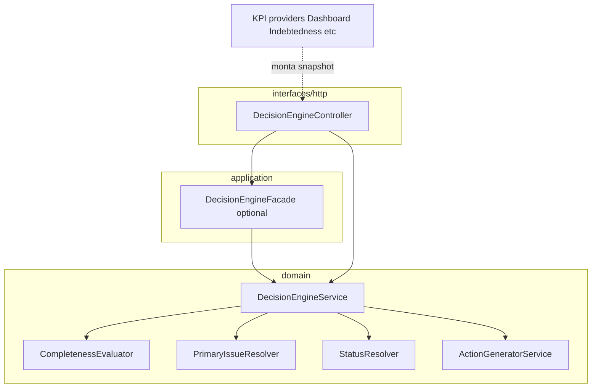

# Technical plan — Decision Engine (NestJS)

**Feature:** `001-financial-decision-engine`  
**Spec:** `spec.md` v0.2  
**Target codebase:** `back-end-financeiro-nestjs` (implementação); este diretório mantém o SDD.

## 1. Goals

- Serviço **determinístico**, **sem IA**, que transforma **snapshot de KPIs + níveis + completude** em `status`, `primary_issue`, `actions[]` conforme contrato.
- **FR-0** (`data_incomplete`) eval **antes** de qualquer escada.
- Camadas **testáveis** com dependências injetáveis; **controller fino** (HTTP + validação DTO apenas).

## 2. Architecture overview

### 2.1 Layering (NestJS module `decision-engine`)

```
src/decision-engine/
├── decision-engine.module.ts
├── interfaces/http/
│   └── decision-engine.controller.ts      # só roteamento + DTO + chama application
├── application/
│   └── decision-engine.facade.ts          # orquestra chamada única ao domínio (opcional se service já for fino)
├── domain/
│   ├── decision-engine.service.ts         # orquestrador principal (entry do domínio)
│   ├── completeness.evaluator.ts        # FR-0 — dados completos?
│   ├── primary-issue.resolver.ts        # FR-1 + FR-2 — escada + desempate
│   ├── status.resolver.ts               # FR-13 / FR-0 override
│   ├── action-generator.service.ts      # FR-8/9/11 — catálogo + parametrização
│   ├── constants.ts                     # RULE_ENGINE_VERSION, KPI_ORDER (desempate lex.), pesos FR-5/6
│   └── catalog/
│       └── action-catalog.ts            # matriz primary_issue × templates de ação (PT-BR)
├── dto/
│   ├── decision-engine-request.dto.ts
│   └── decision-engine-response.dto.ts
└── *.spec.ts (colocados junto aos units testados)
```

**Nota:** Se `decision-engine.facade.ts` for redundante com `DecisionEngineService`, manter **um** entrypoint público (`DecisionEngineService`) registrado no módulo e omitir facade — o plano aceita os dois desenhos desde que o controller **não** contenha regra de negócio.

### 2.2 Responsabilidades

| Componente | Responsabilidade |
| --- | --- |
| **CompletenessEvaluator** | Avalia `DecisionEngineInput.dataCompleteness` + regras duras (§7); retorna `true/false` e lista `missingKpis` / `invalidKpis`. |
| **DecisionEngineService** | Se incompleto → monta resposta FR-0; senão → resolver `primary_issue` → `status` → `actions`. |
| **PrimaryIssueResolver** | Aplica escada FR-1 nos **níveis** (`ok` \| `warn` \| `alert`); ignora degraus sem KPI; desempate FR-2. |
| **StatusResolver** | `critical` / `attention` / `healthy` conforme FR-13; **FR-0** força `attention`. |
| **ActionGeneratorService** | Consulta catálogo por `primary_issue` + níveis disparadores; parametriza `impact` com valores numéricos do input; limite 3; garante mínimo 1 para `healthy` e `data_incomplete`. |

### 2.3 KPI input boundary

- **Não** recalcular KPIs neste módulo na v1: o **cliente HTTP** (outro serviço Nest ou mesmo controller agregador) monta `DecisionEngineInput` a partir de serviços existentes (`Dashboard`, `Indebtedness`, etc.) **ou** expõe endpoint que delega a um **DecisionEngineComposerService** futuro no bounded context de “financial health”.
- O motor **só** consome o contrato em `contracts/decision-engine.types.ts`.

### 2.4 Diagram (container)



## 3. Catálogo `primary_issue` (v1)

Alinhamento **spec FR-1** com os slugs solicitados pelo produto. A escada exige temas para **renda comprometida** e **sobra**; não apareciam na lista curta de 7 itens — **obrigatório** incluir para fidelidade à spec:

| Ordem FR-1 | `primary_issue` slug | KPI(s) principal(is) |
| --- | --- | --- |
| FR-0 | `data_incomplete` | (política de completude) |
| 1 | `liquidity_risk` | `checking_runway_days`, `monthly_cash_flow` |
| 2 | `debt_pressure` | `debt_service_to_income` |
| 3 | `credit_overuse` | `credit_utilization_index` |
| 4 | **`high_commitment`** | `income_committed_pct` |
| 5 | **`low_surplus`** | `surplus_capacity` |
| 6 | `low_savings` | `savings_rate` |
| 7 | `high_fixed_cost` | `fixed_vs_variable_split` (fixo excessivo) |
| — | `healthy` | todos ok + dados completos |

**Aliases legados (evitar):** spec menciona nomes como `liquidity_crisis`; **não usar** na API — apenas os slugs desta tabela.

## 4. Priorização e determinismo

1. **CompletenessEvaluator** roda primeiro → se incompleto, retorno fixo (`primary_issue=data_incomplete`, `status=attention`, ações do catálogo FR-0).
2. Caso completo: **PrimaryIssueResolver** percorre ordem 1→7; primeiro degrau com qualquer KPI em **`warn` ou `alert`** define o tema **apenas se** esse degrau é “ativo” (ver §7 para KPI opcional ausente = degrau omitido, não incompleto).
3. **Desempate FR-2:** dentro do mesmo degrau, maior “severidade numérica” (distância à fronteira da zona); empate → ordem lexicográfica em `constants.ts` (`KPI_LEX_ORDER`).
4. **Sem** `Math.random`, hora atual, ou I/O no caminho quente.
5. **`RULE_ENGINE_VERSION`:** constante string (`"1.0.0"`) exportada; incluída em logs e opcionalmente em header HTTP `X-Decision-Engine-Version`.

## 5. Status (`FR-13`)

| Condição | `status` |
| --- | --- |
| FR-0 disparado | `attention` |
| Alert em nível 1–3 da escada **ou** `monthly_cash_flow` = `alert` | `critical` |
| Caso contrário: existe `warn` ou `alert` em níveis 4–7 | `attention` |
| Todos `ok` | `healthy` |

## 6. Integração HTTP

- **Rota sugerida:** `POST /companies/:companyId/decision-engine/evaluate`
- **Guards:** `JwtAuthGuard`, `CompanyGuard`, permissão de leitura financeira (reutilizar padrão de `indebtedness` / `dashboard`).
- **Body:** `DecisionEngineRequestDto` — espelha `DecisionEngineInput` (ver contracts).
- **Response:** `DecisionEngineResponseDto` — espelha output JSON da spec.
- **Controller:** valida DTO, chama `DecisionEngineService.evaluate(input)`, retorna DTO; **zero** branch de negócio.

### Composer (fora do motor)

Um serviço separado (ex.: `DecisionEngineComposerService` em `dashboard` ou novo agregador) pode:

1. Coletar dados do período (`referenceMonth`, `cashFlowView`).
2. Calcular ou buscar KPIs já existentes.
3. Preencher `dataCompleteness` e `kpiSnapshots`.
4. Chamar `DecisionEngineService.evaluate`.

Isso mantém o motor **puro** e facilita testes unitários com fixtures.

## 7. Observabilidade

- **Log estruturado (Pino):** nível `info` por requisição bem-sucedida com campos:
  - `ruleEngineVersion`
  - `companyId` (id apenas)
  - `primary_issue`, `status`
  - lista de `{ kpiId, level }` recebidos
  - `data_complete: boolean`
  - hash ou checksum opcional do payload normalizado (sem PII)
- **Não** logar descrições longas de transações.
- **Debug:** `debug` com árvore de decisão (qual degrau ganhou) apenas em ambiente dev ou flag.

## 8. Testing strategy (backend SDD)

- **Unit:** `CompletenessEvaluator`, `PrimaryIssueResolver`, `StatusResolver`, `ActionGeneratorService`, `DecisionEngineService` com fixtures de input/output esperados.
- **Casos obrigatórios:** FR-0 prevalece; healthy → exatamente 1 ação; critical quando nível 3 alert; desempate lexicográfico; KPI opcional ausente vs incompleto.
- **Controller spec:** validação DTO + mock do service.

## 9. Module registration

- `DecisionEngineModule`: `providers` exportando `DecisionEngineService` se outros módulos precisarem; `controllers` com `DecisionEngineController`.
- Import em `AppModule`.
- **Sem** dependência circular: motor não importa `DashboardModule` diretamente; quem compõe o input importa ambos.

## 10. Trade-offs

| Decisão | Prós | Contras |
| --- | --- | --- |
| Catálogo em TypeScript (v1) | Determinístico, tipado, fácil diff em PR | Mudança de copy exige deploy |
| KPI numérico no input | UI pode mostrar “impact” parametrizado | Composer deve enviar números confiáveis |
| Sem DSL externa | Sem parser/risco | Menos flexível para não-devs |

## 11. Files to add (implementation checklist)

- [ ] `src/decision-engine/**/*.ts` conforme árvore §2.1  
- [ ] `decision-engine.module.ts` + `app.module.ts` import  
- [ ] Testes `*.spec.ts`  
- [ ] Swagger decorators no controller + DTOs (`@ApiProperty`)  
- [ ] Export de tipos compartilháveis (opcional): duplicar interfaces no front via cópia manual ou pacote shared futuro — **fora deste plano**

---

## Document history

| Version | Date | Notes |
| --- | --- | --- |
| 0.1 | 2026-05-04 | Initial plan from spec v0.2 |
