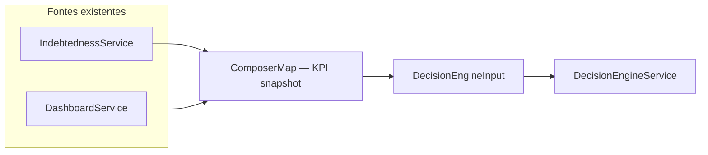

# Data model — Decision Engine Composer (v1)

## Fluxo lógico

## Entidades lógicas

| Nome | Descrição |
| --- | --- |
| **ComposerRequest (HTTP)** | `companyId` (path), `referencePeriod` opcional (query YYYY-MM); `viewMode` do input interno fixo `cash_flow` na v1 |
| **ComposerSourceBundle** | DTOs retornados por Indebtedness + Dashboard no período |
| **DecisionEngineInput** | Contrato existente do motor |

## KPIs obrigatórios do motor vs origem (v1)

| KPI id | Origem principal | Notas |
| --- | --- | --- |
| `monthly_cash_flow` | `DashboardSummaryDto.balance` | Valor = saldo líquido do período; zona por faixas |
| `savings_rate` | `DashboardComparisonDto` | `current.savings / current.income` quando receita > 0 |
| `income_committed_pct` | Heurística `expenses / income` | Proxy até existir métrica dedicada |
| `credit_utilization_index` | `CreditUtilizationDto` | `percentage`; zona derivada de `status` |
| `surplus_capacity` | `LiquidityDto.ratio` + `status` | Proxy de folga / pressão de liquidez |
| `fixed_vs_variable_split` | `getExpensesByCategory` | Concentração na maior categoria / total |
| `debt_service_to_income` | `DebtToRevenueDto` | `percentage`; omitir se receita = 0 |
| `checking_runway_days` | Derivado de `LiquidityDto` + despesas | Opcional; omitir se não calculável |

## Versionamento

- Constante **`COMPOSER_MAPPING_VERSION`** (string) independente de `RULE_ENGINE_VERSION`; bump quando thresholds ou origens mudarem.
