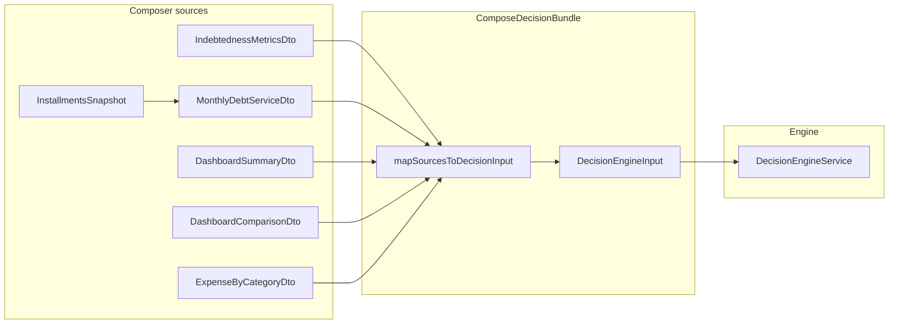
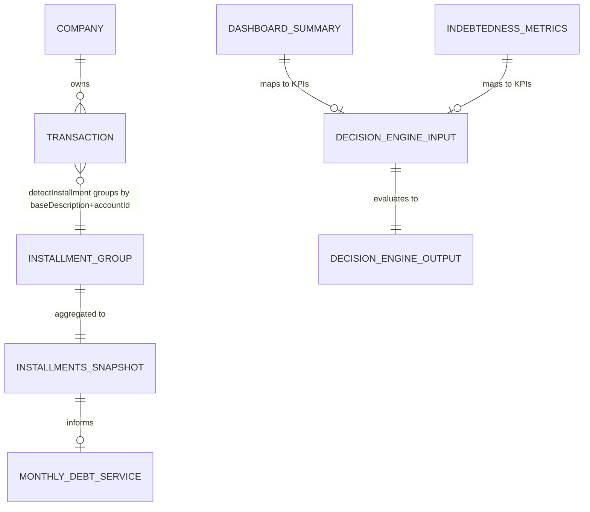

# Data model — Decision Engine Composer

## 1. Logical flow

`InstallmentsSnapshot` does **not** appear as a nested object on `DecisionEngineInput`; it feeds **`calculateMonthlyDebtService`** (and any future KPI mapping that references commitment / debt service).

## 2. Logical entities

| Name | Description |
| --- | --- |
| **ComposeDecisionInputParams** | `companyId`, `referencePeriod` (`YYYY-MM`), `viewMode` (v1: `cash_flow`) |
| **DecisionEngineSources** | Parallel-loaded DTOs + `referenceIso` + **`installments`** |
| **ComposeDecisionBundle** | `DecisionEngineSources` & **`input: DecisionEngineInput`** |
| **InstallmentsSnapshot** | `items: ActiveInstallmentSummary[]`, `totalMonthly: number` |
| **ActiveInstallmentSummary** | `description`, `monthlyValue`, `remaining`, `endDate` (ISO date string), `accountId`, `accountType`, optional `categoryId`, `priority` |

Canonical TypeScript mirrors: `contracts/composer-sources.types.ts` (this spec) and **`specs/001-financial-decision-engine/contracts/decision-engine.types.ts`** for `DecisionEngineInput` / output types.

## 3. Installments reconcile (read model)

Diagnostic aggregate (not persisted):

| Section | Purpose |
| --- | --- |
| **diagnostic** | `referenceStartOfDayUtc`, `windowEndUtc`, funnel **counts**, **snapshot** echo, **integrity** (`sumOfItemMonthlyValues` vs `totalMonthly`) |
| **atlasExplorerFilter / suggestedMongosh** | Copy-paste validation against MongoDB |
| **bundleCrossCheck** | Compares `composeBundle` installment slice to diagnostic snapshot (concurrency / drift detection) |
| **projection** | Same 30/60/90 projection shape as complete plan for cross-validation |
| **decisionValidationNotes** | Human-readable checklist strings |

*ER is conceptual; physical persistence is `transactions` (Mongo) and in-memory DTOs only for composer output.*

## 4. Versioning

| Constant | When to bump |
| --- | --- |
| **`COMPOSER_MAPPING_VERSION`** | KPI zone thresholds, new KPI mapping, or source DTO field changes affecting `DecisionEngineInput` |
| **`RULE_ENGINE_VERSION`** | Owned by `DecisionEngineService`; independent of composer |

## Document history

| Version | Date | Notes |
| --- | --- | --- |
| 0.1 | 2026-05-04 | Sources + KPI table only |
| 0.2 | 2026-05-04 | Added `InstallmentsSnapshot`, bundle, reconcile ER |
