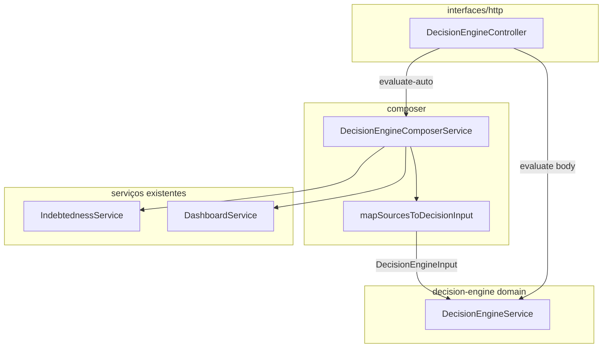

# Technical plan — Decision Engine Composer (NestJS)

**Feature:** `002-decision-engine-composer`  
**Depends on:** `001-financial-decision-engine` (motor + contrato `DecisionEngineInput`)

## 1. Goals

- Serviço **`DecisionEngineComposerService`** que monta `DecisionEngineInput` a partir de **`IndebtednessService`** e **`DashboardService`**.
- Endpoint **`POST .../decision-engine/evaluate-auto`** que: composer → `DecisionEngineService.evaluate` → mesma resposta que `evaluate`.
- Mapeamento **puro** em módulo testável (`map-sources-to-input.ts`) + constante **`COMPOSER_MAPPING_VERSION`**.

## 2. Arquitetura

## 3. Módulo NestJS

- **`DecisionEngineModule`**: importar `DashboardModule`, `IndebtednessModule` (já exportam services); registrar `DecisionEngineComposerService`.
- **Sem** import circular: `DashboardModule` / `IndebtednessModule` não dependem de `DecisionEngineModule`.

## 4. HTTP

- Rota: `POST /companies/:companyId/decision-engine/evaluate-auto`
- **Query opcional:** `referencePeriod=YYYY-MM` (default mês UTC corrente). **Sem body** nesta versão.
- **Guards:** iguais ao `evaluate` — `JwtAuthGuard`, `CompanyPermissionGuard`, `Permission.INDEBTEDNESS_READ`.
- **DTO:** `DecisionEngineEvaluateAutoQueryDto` + `class-validator`; `whitelist` global já ativo.

## 5. `viewMode` (v1)

Sempre **`cash_flow`** ao montar `DecisionEngineInput`. Accrual fica fora do contrato público até haver fontes distintas; ver Open Question na spec.

## 6. Observabilidade

- Log `info` no composer: `composerVersion`, `companyId`, `referencePeriod`, contagens agregadas (sem payload bruto de transações).

## 7. Testes

- **Unit:** `map-sources-to-input.spec.ts` com fixtures mínimas de DTOs.
- **Nest:** `decision-engine-composer.service.spec.ts` com mocks de `IndebtednessService` / `DashboardService` verificando chamadas e formato do input.
- **Controller:** teste do novo método com composer + engine mockados (ou só composer mock + engine real leve).

## 8. Documentação API

- Atualizar `docs/API_ROUTES.md` no repositório da API.

## Document history

| Version | Date | Notes |
| --- | --- | --- |
| 0.1 | 2026-05-04 | Plano inicial |
