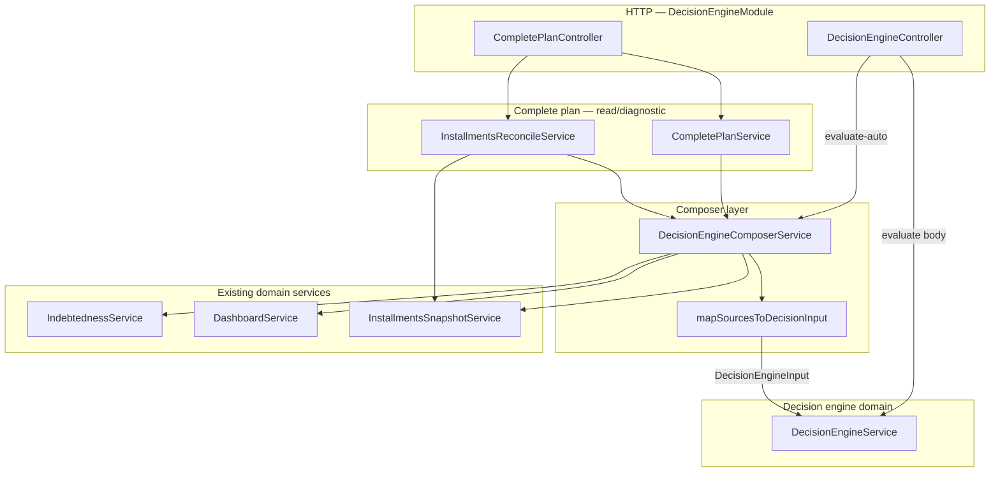

# Technical plan — Decision Engine Composer (NestJS)

**Feature:** `002-decision-engine-composer`  
**Depends on:** `001-financial-decision-engine` (engine + `DecisionEngineInput` / `DecisionEngineOutput`)  
**Related:** `004-complete-financial-plan` (complete plan + projections consume the same composer bundle)

## 1. Goals

| Goal | Detail |
| --- | --- |
| **G1** | `DecisionEngineComposerService` builds `DecisionEngineInput` from **existing** services: `IndebtednessService`, `DashboardService`, and **`InstallmentsSnapshotService`**. |
| **G2** | **`POST .../decision-engine/evaluate-auto`** runs composer → `DecisionEngineService.evaluate` → same wire shape as manual `evaluate`. |
| **G3** | **`composeBundle`** returns the composed **`DecisionEngineInput`** plus **raw source DTOs** (including `installments`) so downstream features (complete plan, debt service, QA reconcile) share one load path. |
| **G4** | Mapping from sources to KPI snapshots stays **pure** (`map-sources-to-input.ts`) + **`COMPOSER_MAPPING_VERSION`** bump policy. |

## 2. Architecture (containers & flow)

Aligned with `memory/constitution.md`: SPA → **Air Finance API** only; composer lives in **`back-end-financeiro-nestjs`** (`src/decision-engine/`).

**Layering:** `DashboardModule` / `IndebtednessModule` do not depend on `DecisionEngineModule`. `CompletePlanModule` consumes `DecisionEngineComposerService` (no circular dependency back into dashboard internals).

## 3. Data loading sequence

1. **Normalize** `referencePeriod` (`YYYY-MM`) and derive **`referenceIso`** for dashboard/indebtedness time range.  
2. **`Promise.all`** (independent): `getSummary`, `getComparison`, `getExpensesByCategory`, **`installmentsSnapshotService.build(companyId)`**.  
3. **`Promise.all`**: `getIndebtednessMetrics`, **`calculateMonthlyDebtService(..., installments.totalMonthly, ...)`** — debt-service KPI uses installment snapshot aggregate.  
4. **`mapSourcesToDecisionInput`** → `DecisionEngineInput` (does not embed raw installments on the engine input; installments influence only via derived metrics in v1).

## 4. HTTP surface (this feature)

| Method | Path | Role |
| --- | --- | --- |
| `POST` | `/companies/:companyId/decision-engine/evaluate-auto` | Composer + engine; query `referencePeriod` optional. |
| `GET` | `/companies/:companyId/decision-engine/installments-reconcile` | **Read-only** diagnostics: funnel counts, snapshot, bundle cross-check vs `composeBundle`, projection slice, Atlas/mongosh hints. Implemented under `CompletePlanController`; contract fragment in `contracts/installments-reconcile.openapi.yaml`. |

**Guards:** `JwtAuthGuard`, `CompanyPermissionGuard`, `Permission.INDEBTEDNESS_READ` (same family as indebtedness read).

## 5. `viewMode` (v1)

Per **FR-1 / spec**: composer passes **`cash_flow`** only until accrual sources exist; no public accrual toggle.

## 6. Installments snapshot — integration contract

- **Source:** Mongo `transactions` via `InstallmentsSnapshotService` (description-based `detectInstallment`; not `quantityInstallments`-only).  
- **Consumers:** `calculateMonthlyDebtService`, complete plan numbers/projection, reconcile endpoint.  
- **Known semantic gap:** “Future expenses” ⊃ “installment groups”; product copy and reconcile counts explain the funnel.  
- **Engineering follow-ups** (backlog, not blocking this plan file): deterministic `find` ordering for `monthlyValue`; single definition of “start of day” vs UTC for filters (see `research.md`).

## 7. Observability

- Structured log on compose: `composerMappingVersion`, `companyId`, `referencePeriod`, `viewMode`, aggregate counts (no raw transaction payloads).  
- Reconcile path: optional debug-level logs only if needed for support; avoid PII.

## 8. Testing strategy

| Layer | Target |
| --- | --- |
| Unit | `map-sources-to-input.spec.ts` — fixtures, zone mapping. |
| Unit | `decision-engine-composer.service.spec.ts` — mocks for IND/DASH/ISS; assert `composeBundle` ordering and `monthlyDebtService` inputs. |
| Unit | `installments-reconcile.service.spec.ts` — diagnostics + bundle cross-check. |
| Controller | `decision-engine.controller.spec.ts` — `evaluate-auto` query + composed input passed to engine. |
| Integration | `compose-evaluate.integration.spec.ts` — composer + real engine where feasible. |

## 9. Cross-repo documentation

- Update **`back-end-financeiro-nestjs/docs/API_ROUTES.md`** when routes or query contracts change.  
- Monorepo **`specs/001-financial-decision-engine/spec.md`**: UI scope for `/decision` remains the **001** track; **002** spec “Out of scope — UI” should be reconciled with **review.md** (either amend 002 or explicitly defer UI to 001).

## 10. Trade-offs (explicit)

| Decision | Upside | Downside |
| --- | --- | --- |
| Reuse dashboard + indebtedness DTOs | Single source of KPI truth; less drift | Composer mapping must version when upstream DTOs change |
| `composeBundle` exposes raw sources | One parallel fetch for complete plan + reconcile | Larger in-memory object; callers must not log full bundle in prod |
| Text-based installments | Works for OFX-style descriptions | Under-counts vs all future expenses; field-only installment rows need future policy |

## Document history

| Version | Date | Notes |
| --- | --- | --- |
| 0.1 | 2026-05-04 | Initial plan (evaluate-auto + map only) |
| 0.2 | 2026-05-04 | Added `InstallmentsSnapshotService`, `composeBundle`, complete-plan + reconcile integration, Mermaid container diagram |
