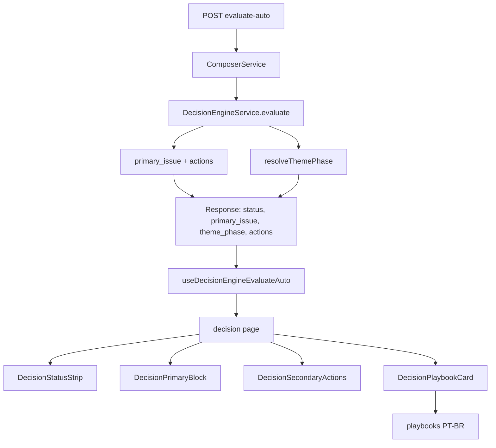

# Plan — Decision playbook 3 phases

> HOW para `spec.md`. Arquitetura híbrida: backend só resolve a fase ativa por tema; todo o conteúdo PT-BR vive no frontend. Nada do contrato existente é quebrado — `theme_phase` é campo opcional/nullable.

---

## 1. Resumo da abordagem

- **Backend** ganha apenas um campo opcional `theme_phase: 'red' | 'yellow' | 'green' | null`. Lógica numérica pura: a fase do tema deriva do nível do KPI principal do `primary_issue` (`alert→red`, `warn→yellow`, `ok→green`; `data_incomplete→null`; `healthy→green`).
- **Frontend** ganha um catálogo de playbooks PT-BR (9 entradas) e um novo componente que renderiza o playbook da fase ativa abaixo do "Próximo passo" + "Outros passos" atuais.
- O "Próximo passo" com R$ / % calculado **continua intocado** — é o gancho que faz o usuário agir hoje. O playbook ensina o caminho completo.

---

## 2. Mapa de fases por tema

| Tema (slug) | KPI principal usado para fase |
| --- | --- |
| `liquidity_risk` | `monthly_cash_flow` (fallback `checking_runway_days`) |
| `debt_pressure` | `debt_service_to_income` |
| `credit_overuse` | `credit_utilization_index` |
| `high_commitment` | `income_committed_pct` |
| `low_surplus` | `surplus_capacity` |
| `low_savings` | `savings_rate` |
| `high_fixed_cost` | `fixed_vs_variable_split` |
| `healthy` | sempre `green` |
| `data_incomplete` | `null` (mostra placeholder) |

---

## 3. Backend — mudanças mínimas

### 3.1. Resolver de fase

**Arquivo novo**: `back-end-financeiro-nestjs/src/decision-engine/domain/theme-phase.resolver.ts`.

```ts
export type ThemePhase = 'red' | 'yellow' | 'green';

const THEME_DRIVER_KPI: Record<PrimaryIssueSlug, KnownKpiId | null> = {
  liquidity_risk: 'monthly_cash_flow',
  debt_pressure: 'debt_service_to_income',
  credit_overuse: 'credit_utilization_index',
  high_commitment: 'income_committed_pct',
  low_surplus: 'surplus_capacity',
  low_savings: 'savings_rate',
  high_fixed_cost: 'fixed_vs_variable_split',
  healthy: null,
  data_incomplete: null,
};

export function resolveThemePhase(primary, kpis): ThemePhase | null { ... }
```

Mapping: `alert → red`, `warn → yellow`, `ok|undefined → green`. `healthy → green`. `data_incomplete → null`. Fallback se KPI driver ausente: pior nível entre os KPIs do degrau correspondente em `DECISION_LADDER` (`decision-engine.constants.ts`).

**Spec colocada**: `theme-phase.resolver.spec.ts` cobrindo cada slug em `ok`/`warn`/`alert` + `healthy` + `data_incomplete` + KPI ausente.

### 3.2. Output e DTO

`src/decision-engine/domain/decision-engine.types.ts`:

```ts
export type ThemePhase = 'red' | 'yellow' | 'green';

export interface DecisionEngineOutput {
  status: DecisionStatus;
  primary_issue: PrimaryIssueSlug;
  theme_phase: ThemePhase | null;
  ordering_rationale: string;
  actions: readonly DecisionAction[];
  ruleEngineVersion?: string;
}
```

`src/decision-engine/dto/decision-engine-response.dto.ts` — adicionar:

```ts
@ApiProperty({
  enum: ['red', 'yellow', 'green'],
  nullable: true,
  description: 'PT-BR: fase do tema principal (vermelho / amarelo / verde). null quando primary_issue=data_incomplete.',
})
readonly theme_phase!: ThemePhase | null;
```

### 3.3. Service e controller

`src/decision-engine/domain/decision-engine.service.ts`: na composição final (ramos `data_incomplete` e normal), chamar `resolveThemePhase(primaryIssue, input.kpis)` e incluir no output.

`src/decision-engine/interfaces/http/decision-engine.controller.ts`: `toResponseDto` propaga `theme_phase` do output.

### 3.4. Testes a estender

- `decision-engine.service.spec.ts`: assert `theme_phase` em cenários `healthy` / `data_incomplete` / cada slug com `alert+warn+ok`.
- `decision-engine.controller.spec.ts`: garantir serialização de `theme_phase`.
- `test/decision-engine-evaluate-auto.e2e-spec.ts`: snapshot inclui `theme_phase ∈ {red, yellow, green, null}`.

---

## 4. Frontend — catálogo + UI

### 4.1. Schema do serviço

`apps/web/src/services/decisionEngineService.ts` — estender Zod:

```ts
const ThemePhaseSchema = z.enum(['red', 'yellow', 'green']);

const DecisionEngineEvaluateResponseSchema = z.object({
  ...,
  theme_phase: ThemePhaseSchema.nullable().optional(),
  ...,
});
```

Backward compatible: payloads sem `theme_phase` parseiam normalmente (campo `undefined`).

### 4.2. Catálogo de playbooks

Pasta nova: `apps/web/src/pages/decision/playbooks/`.

```
playbooks/
  types.ts                    # Playbook, PhaseContent, ThemePhase, PlaybookSlug
  index.ts                    # getPlaybook(slug), ALL_PLAYBOOKS
  liquidityRisk.ts
  debtPressure.ts
  creditOveruse.ts
  highCommitment.ts
  lowSurplus.ts
  lowSavings.ts
  highFixedCost.ts
  healthy.ts
  dataIncomplete.ts
  playbooks.test.ts           # valida shape de todos os slugs
```

Shape: ver `data-model.md` e `contracts/decision-engine.types.ts`.

`playbooks.test.ts`:
- Para cada slug, `actions.length` entre 3 e 5 nas 3 fases.
- `rule` e `expectedImpact` não-vazios.
- Lista de termos proibidos: `KPI`, `índice`, `taxa de`, `rotativo`, `severity`, `snapshot`.
- Slug desconhecido cai em `healthy`.

### 4.3. Componente `DecisionPlaybookCard`

`apps/web/src/pages/decision/components/DecisionPlaybookCard.tsx`. Recebe `playbook: Playbook` e `phase: ThemePhase | null | undefined`. Renderiza, com primitivos do DS (`Card`, `CardHeader`, `CardContent`, `Badge`):

- Cabeçalho: título do tema + Badge da fase ativa (`destructive`, âmbar custom, `success`).
- Bloco "O que está acontecendo": `explanation`.
- Bloco "Seu plano por etapa" — 3 sub-seções (vermelho, amarelo, verde) em **acordeão acessível** (`<button aria-expanded aria-controls>` + `role="region"`), com a fase ativa **expandida por padrão**.
- Bloco "Regra simples": destaque visual leve (`border-l-4 border-l-primary-500`) com ícone `Lightbulb`.
- Bloco "Resultado esperado": frase única, ícone `Sparkles`, tom positivo.
- `phase === null | undefined`: card mostra apenas explicação + mensagem "Complete os dados…" — sem acordeão.

Mobile-first (`px-4 sm:px-6`, `space-y-4`), dark mode via tokens do DS, sem cores hardcoded fora dos tokens semânticos.

### 4.4. Integração na página

`apps/web/src/pages/decision/index.tsx`: após `DecisionSecondaryActions`, renderizar:

```tsx
<DecisionPlaybookCard
  playbook={getPlaybook(query.data.primary_issue)}
  phase={query.data.theme_phase ?? null}
/>
```

Nada mais muda na página (`DecisionStatusStrip`, `DecisionPrimaryBlock`, `DecisionSecondaryActions` permanecem intactos).

### 4.5. Testes de UI

- `DecisionPlaybookCard.test.tsx`:
  - renderiza fase correta expandida (`aria-expanded='true'`);
  - alterna acordeão ao clicar em outra fase;
  - mostra placeholder em `data_incomplete` (phase null);
  - renderiza blocos `Regra simples` e `Resultado esperado`.
- `playbooks.test.ts`: shape válido nos 9 slugs.

---

## 5. Diagrama do fluxo final



---

## 6. Quality gates

- Backend: `yarn lint` + `yarn jest <theme-phase|service|controller>` (em `--runInBand` por causa do `MongoMemoryServer` global em `src/test/setup.ts`).
- Frontend: `yarn typecheck` + `yarn lint` no monorepo; suítes verdes em `pages/decision/`, `services/decisionEngineService`, `hooks/useDecisionEngineEvaluateAuto`.
- Sem novas dependências.
- Nenhuma alteração em `.env`.

---

## 7. Risco / mitigação

| Risco | Mitigação |
| --- | --- |
| Cliente antigo recebe `theme_phase` e estoura | Campo é opcional/nullable; Zod no frontend trata `undefined` e `null`. |
| Catálogo desatualizado para um novo slug | `getPlaybook` cai em `healthy` (fallback seguro); teste `'falls back to healthy'` cobre. |
| Texto técnico vazando para usuário | Lista de termos proibidos validada em `playbooks.test.ts`. |
| Acordeão inacessível | `aria-expanded` + `aria-controls` + foco visível; teste cobre interação por `role="button"` / `role="region"`. |
