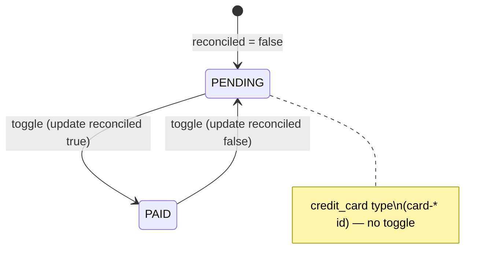
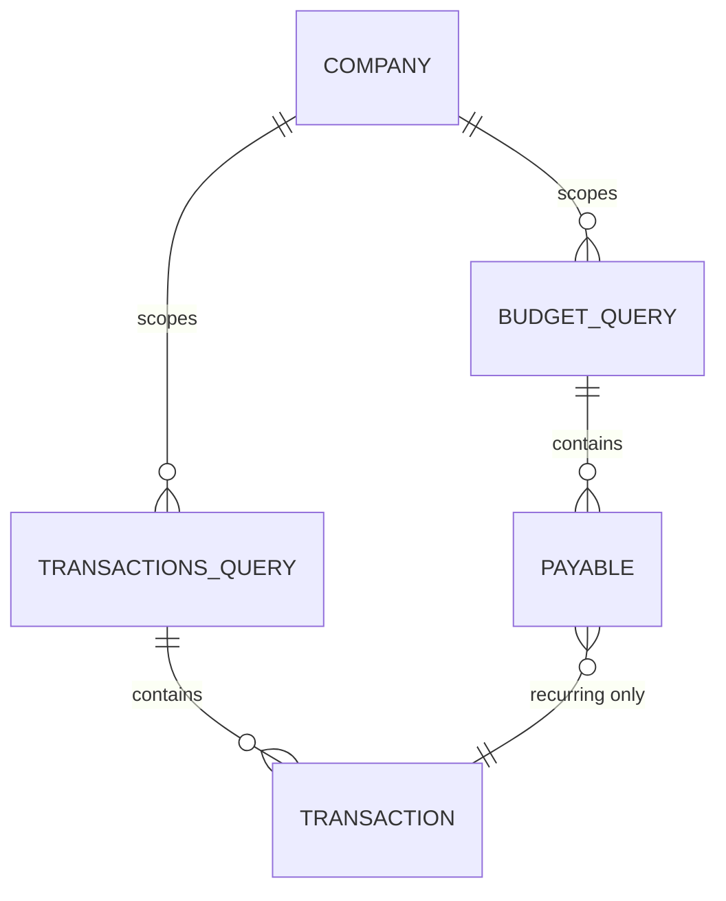

# Data model — Payables unified update

Frontend-only feature. No new persistence entities. Documents the **logical model** and **cache keys** involved.

## 1. Domain entities (existing)

### Payable (UI aggregate)

From `apps/web/src/types/budget.ts`:

| Field | Type | Notes |
| --- | --- | --- |
| `id` | `string` | Transaction id, or `card-{billId}` for credit card bills |
| `description` | `string` | Display label |
| `value` | `number` | Amount in BRL |
| `dueDate` | `string` | ISO or API date string |
| `status` | `'PENDING' \| 'PAID'` | Maps from `Transaction.reconciled` |
| `type` | `'recurring' \| 'credit_card'` | Drives grouping in UI |

### Transaction (API source for recurring payables)

Partial update fields used by this feature:

| Field | Type | UI action |
| --- | --- | --- |
| `value` | `number` | Inline edit |
| `reconciled` | `boolean` | Status toggle (`true` → PAID) |

## 2. Status mapping



| UI status | `reconciled` | Toggle allowed |
| --- | --- | --- |
| Pendente | `false` | Yes (if not `card-*`) |
| Pago | `true` | Yes (if not `card-*`) |

## 3. Client cache (TanStack Query)



| Query key | Source | Invalidated on payable update |
| --- | --- | --- |
| `['budget', companyId]` | Budget page / payables list | Yes |
| `['transactions', companyId, ...]` | Transaction lists | Yes (prefix) |

## 4. Hook state (ephemeral, not persisted)

| State | Owner | Purpose |
| --- | --- | --- |
| `editingId` | `usePayableActions` | Which row is in value edit mode |
| `editingValue` | `usePayableActions` | Raw input string (comma decimal) |
| `togglingId` | `usePayableActions` | Disable badge during status mutation |
| `isUpdating` | `useTransactions` | Pending mutation flag |

## 5. Payload contract (internal)

See `contracts/payables-update.types.ts`:

```typescript
interface PayableUpdatePayload {
  readonly value?: number;
  readonly reconciled?: boolean;
}
```

At least one field required per call; hooks send single-field updates (never batched status+value in one user gesture in v1).
