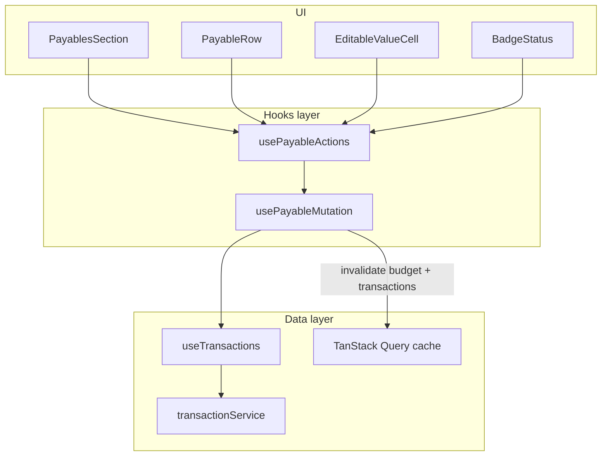
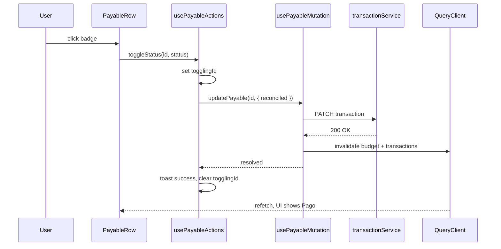

# Technical plan — Payables unified update (frontend)

**Feature:** `006-payables-unified-update`  
**Repo:** `air-finance-app` (`apps/web` only)  
**Depends on:** existing `useTransactions` + `transactionService.updateTransaction`

## 1. Problem statement

Two hooks power the expanded payables modal:

| Hook | File | Action |
| --- | --- | --- |
| `usePayableStatus` | `apps/web/src/components/budget/hooks/usePayableStatus.ts` | toggles `reconciled` |
| `useEditableValue` | `apps/web/src/components/budget/hooks/useEditableValue.ts` | updates `value` |

Both share the same anti-pattern:

```typescript
await Promise.resolve(
  updateTransaction({ id, data: { ... } }),
);
```

`useTransactions` exposes `updateMutation.mutate` (not `mutateAsync`). `mutate` returns `void`; wrapping it in `Promise.resolve` resolves **immediately**. The `try/finally` blocks therefore clear loading state and show success **before** the HTTP call completes — causing the user to click/save twice.

Both hooks also duplicate:

- `useCompanyStore` / `companyId`
- `queryClient.invalidateQueries` for `['budget', companyId]` and `['transactions', companyId]`
- error/success toast patterns

## 2. Goals

| Goal | Detail |
| --- | --- |
| **G1** | Single async mutation path that **awaits** the HTTP update |
| **G2** | One invalidation helper for budget + transactions queries |
| **G3** | Preserve separate UX for value editing vs status toggle (different toasts, editing state) |
| **G4** | No backend or API contract changes |
| **G5** | TDD: failing tests first for the mutation await bug |

## 3. Architecture



**Layering (constitution-aligned):**

- `usePayableMutation` — thin wrapper: `mutateAsync`, invalidation, typed payload.
- `usePayableActions` — composes mutation + UI state (editing value, toggling id, validation, toasts).
- `PayablesSection` — consumes only `usePayableActions` (one hook call).

## 4. Implementation design

### 4.1 Extend `useTransactions`

Add `updateTransactionAsync: updateMutation.mutateAsync` to the return object of `useTransactions` (`apps/web/src/hooks/useTransactions.ts`).

Keep `updateTransaction: mutate` for backward compatibility elsewhere; payables path uses async only.

Optional (recommended): add `onSuccess` invalidation for `['budget', companyId]` inside `updateMutation` when callers opt in — **deferred to v1.1** to avoid broad invalidation side effects. v1 keeps explicit invalidation in `usePayableMutation`.

### 4.2 New `usePayableMutation`

**Path:** `apps/web/src/components/budget/hooks/usePayableMutation.ts`

```typescript
interface PayableUpdatePayload {
  readonly value?: number;
  readonly reconciled?: boolean;
}

function invalidatePayableQueries(queryClient, companyId: string): void
async function updatePayable(id: string, data: PayableUpdatePayload): Promise<void>
```

- Uses `updateTransactionAsync`.
- On success: invalidate `['budget', companyId]` and `['transactions', companyId]` (prefix match).
- Re-throws errors for caller-specific toasts.

### 4.3 New `usePayableActions`

**Path:** `apps/web/src/components/budget/hooks/usePayableActions.ts`

Combines:

| Concern | From (legacy) | Notes |
| --- | --- | --- |
| Value editing state | `useEditableValue` | `editingId`, `editingValue`, `inputRef`, sanitization |
| Status toggle guard | `usePayableStatus` | `isToggleable`, `togglingId` |
| Mutation | `usePayableMutation` | shared |

Public API (drop-in for `PayablesSection`):

```typescript
{
  editingId, editingValue, inputRef, isUpdating,
  togglingId, isToggleable,
  startEditing, saveValue, handleKeyDown, handleValueChange,
  toggleStatus,
}
```

### 4.4 Deprecate / remove legacy hooks

After migration + tests green:

- Delete `useEditableValue.ts` (budget-specific; grep for other usages first).
- Delete `usePayableStatus.ts`.

If `useEditableValue` is reused elsewhere later, extract generic `useInlineNumericEdit` without mutation — out of scope for v1.

### 4.5 `PayablesSection` change

Replace dual hook calls with single `usePayableActions()`. No prop changes to `PayableRow`.

## 5. Sequence — status toggle (fixed)



## 6. Key trade-offs

| Choice | Rationale | Alternative rejected |
| --- | --- | --- |
| `mutateAsync` in dedicated hook | Minimal change; fixes await bug | Keep `mutate` + callbacks (harder to test, error-prone) |
| Two-layer hooks (mutation + actions) | Separates I/O from UI editing state | Single god hook (harder to test mutation alone) |
| Explicit budget invalidation in payables hook | Scoped; no global mutation side effects | Global `onSuccess` on all updates (over-invalidation) |
| No optimistic UI v1 | Lower risk; bugfix focus | Optimistic update (nice UX, extra rollback logic) |

## 7. Testing strategy (TDD)

| Test file | Cases |
| --- | --- |
| `usePayableMutation.test.ts` | awaits API; invalidates both query keys; propagates errors |
| `usePayableActions.test.ts` | toggle once → one API call; save value once → one API call; `card-*` not toggleable; invalid value toast, no API call |
| Regression | `PayablesSection` smoke render with mocked hook (optional) |

Mock `useTransactions` / `updateTransactionAsync` at boundary; use `@testing-library/react` `renderHook`.

## 8. Integration points

| Boundary | Contract |
| --- | --- |
| REST | Existing `PATCH .../transactions/:id` partial body `{ value?, reconciled? }` |
| TanStack Query | Invalidate `['budget', companyId]`, `['transactions', companyId]` |
| Types | `Payable`, `CreateTransactionPayload` partial — see `contracts/payables-update.types.ts` |

## 9. Rollout & verification

1. Implement + tests (FE only).
2. Manual: open Budget → Contas a Pagar → Expandir → toggle status once; edit value once.
3. Confirm totals in group headers and footer update without second action.
4. No `.env` or backend deploy required.

## 10. Files touched (expected)

| Action | Path |
| --- | --- |
| Modify | `apps/web/src/hooks/useTransactions.ts` |
| Create | `apps/web/src/components/budget/hooks/usePayableMutation.ts` |
| Create | `apps/web/src/components/budget/hooks/usePayableActions.ts` |
| Create | `*.test.ts` colocated |
| Modify | `apps/web/src/components/budget/sections/PayablesSection.tsx` |
| Delete | `useEditableValue.ts`, `usePayableStatus.ts` (after grep clean) |
