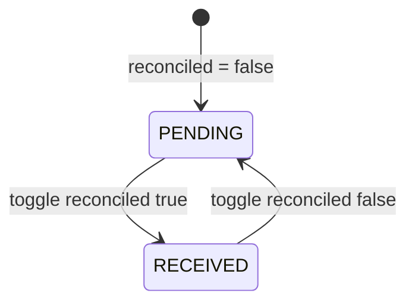

# Data model — Receivables inline update

Frontend-only feature. No new persistence entities.

## 1. Domain entities (existing)

### Receivable (UI aggregate)

From `apps/web/src/types/budget.ts`:

| Field | Type | Notes |
| --- | --- | --- |
| `id` | `string` | Transaction id |
| `description` | `string` | Display label |
| `value` | `number` | Amount in BRL |
| `dueDate` | `string` | ISO or API date string |
| `status` | `'PENDING' \| 'RECEIVED'` | Maps from `Transaction.reconciled` |

### Transaction (API source)

| Field | Type | UI action |
| --- | --- | --- |
| `value` | `number` | Inline edit |
| `reconciled` | `boolean` | Status toggle (`true` → RECEIVED) |

## 2. Status mapping

| UI status | `reconciled` | Toggle allowed |
| --- | --- | --- |
| Pendente | `false` | Yes |
| Recebido | `true` | Yes |

## 3. Client cache (TanStack Query)

| Query key | Invalidated on receivable update |
| --- | --- |
| `['budget', companyId]` | Yes |
| `['transactions', companyId, ...]` | Yes (prefix) |

## 4. Hook state (ephemeral)

| State | Owner | Purpose |
| --- | --- | --- |
| `editingId` | `useReceivableActions` | Which row is in value edit mode |
| `editingValue` | `useReceivableActions` | Raw input string (comma decimal) |
| `togglingId` | `useReceivableActions` | Disable badge during status mutation |

## 5. Payload contract

See `contracts/receivables-update.types.ts`. Runtime implementation: `apps/web/src/components/budget/hooks/receivableUpdate.types.ts`.

At least one field per call; hooks send single-field updates (status or value, not both in one gesture).
