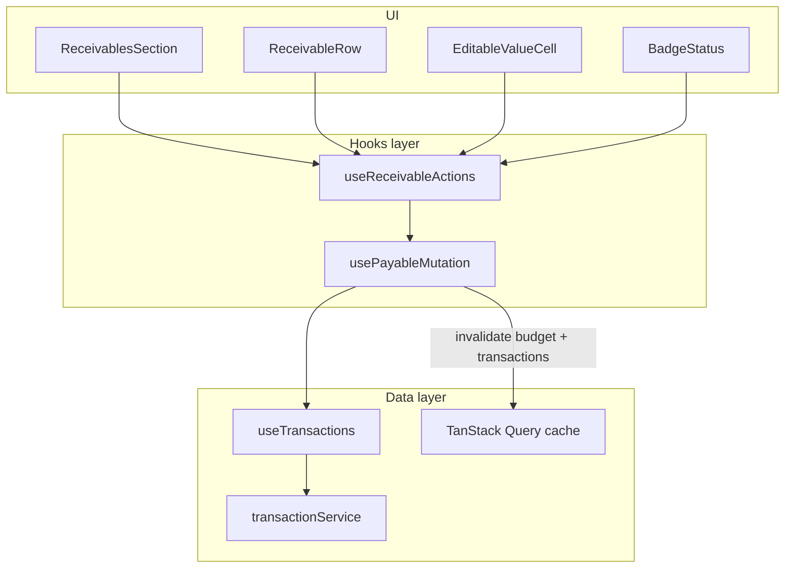
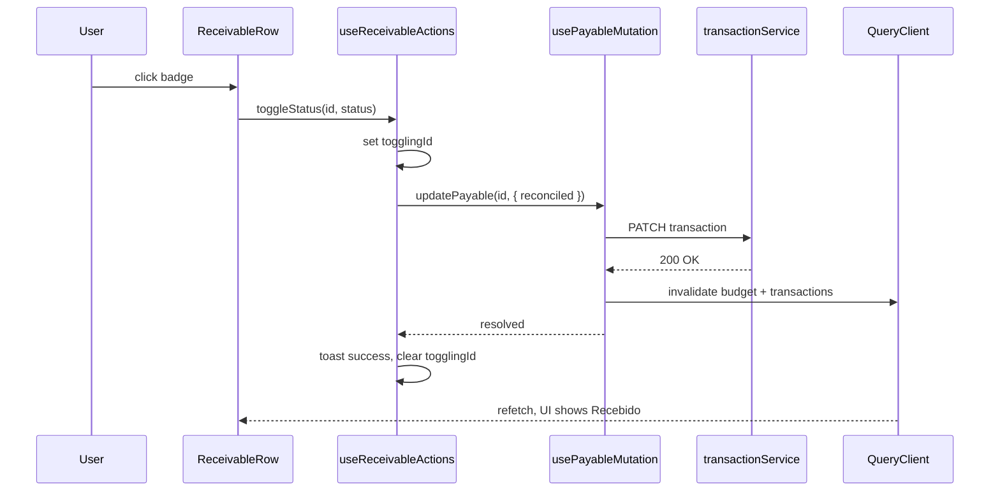

# Technical plan — Receivables inline update (frontend)

**Feature:** `007-receivables-inline-update`  
**Repo:** `air-finance-app` (`apps/web` only)  
**Depends on:** `usePayableMutation` (006) + `useTransactions` + `transactionService.updateTransaction`

## 1. Problem statement

`ReceivablesSection` renders status and value as read-only:

- `BadgeStatus` without `onClick`
- Value as static `formatCurrency` span

Payables already support inline edit via `usePayableActions` → `usePayableMutation` → `updateTransactionAsync`. Receivables share the same data source (transactions with `reconciled` / `value`) but lack the UI wiring.

## 2. Goals

| Goal | Detail |
| --- | --- |
| **G1** | Parity UX with Contas a Pagar for status toggle and value edit |
| **G2** | Reuse `usePayableMutation` (no second invalidation path) |
| **G3** | Keep receivables visual identity (`warning`/`success`, labels Recebido/Pendente) |
| **G4** | No backend or API contract changes |
| **G5** | TDD: failing tests first for actions and section interaction |

## 3. Architecture

**Layering:**

- `usePayableMutation` — reuse as-is (typed payload `{ value?, reconciled? }`).
- `useReceivableActions` — UI state + toasts + toggle/save for `Receivable` status.
- `ReceivablesSection` — `ReceivableRow` / `ReceivablesTable` (replace read-only `SectionTable`).

## 4. Implementation design

### 4.1 `receivableUpdate.types.ts`

Guards always return `true` (all budget receivables are real transactions). Mapping helpers:

- `receivableStatusToReconciled('RECEIVED')` → `true`
- `reconciledToReceivableStatus(true)` → `'RECEIVED'`

### 4.2 `useReceivableActions`

Mirror `usePayableActions` with:

- Toggle: `newReconciled = currentStatus !== 'RECEIVED'`
- Toasts: "Marcado como recebido" / "Marcado como pendente"
- Same value parse / Enter / blur / Escape / `skipBlurSaveRef` pattern
- Calls `updatePayable` from `usePayableMutation` (shared mutation)

### 4.3 `ReceivablesSection`

- Replace `SectionTable` + `renderCell` with `ReceivableRow` + `ReceivablesTable`
- Keep grouping: Parcelas Finalizando / Outras Receitas + `TotalFooter`
- Status colors: `warning` / `success` (not payables `danger`)

## 5. Sequence — status toggle

## 6. Testing strategy (TDD)

| Test file | Cases |
| --- | --- |
| `receivableUpdate.types.test.ts` | editability always true; status ↔ reconciled mapping |
| `useReceivableActions.test.tsx` | toggle once; save once; invalid value; unchanged skip |
| `ReceivablesSection.test.tsx` | badge clickable; double-click enters edit mode |

## 7. Files touched (expected)

| Action | Path |
| --- | --- |
| Create | `apps/web/src/components/budget/hooks/receivableUpdate.types.ts` |
| Create | `apps/web/src/components/budget/hooks/receivableUpdate.types.test.ts` |
| Create | `apps/web/src/components/budget/hooks/useReceivableActions.ts` |
| Create | `apps/web/src/components/budget/hooks/useReceivableActions.test.tsx` |
| Modify | `apps/web/src/components/budget/sections/ReceivablesSection.tsx` |
| Create | `apps/web/src/components/budget/sections/ReceivablesSection.test.tsx` |
| Reuse | `usePayableMutation.ts` (no change) |
